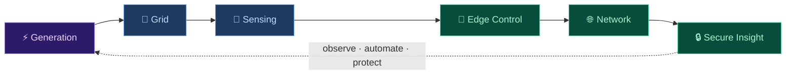
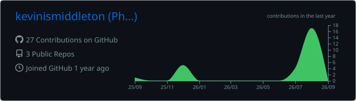
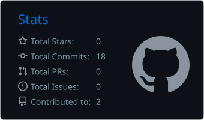
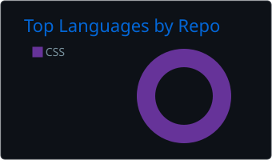
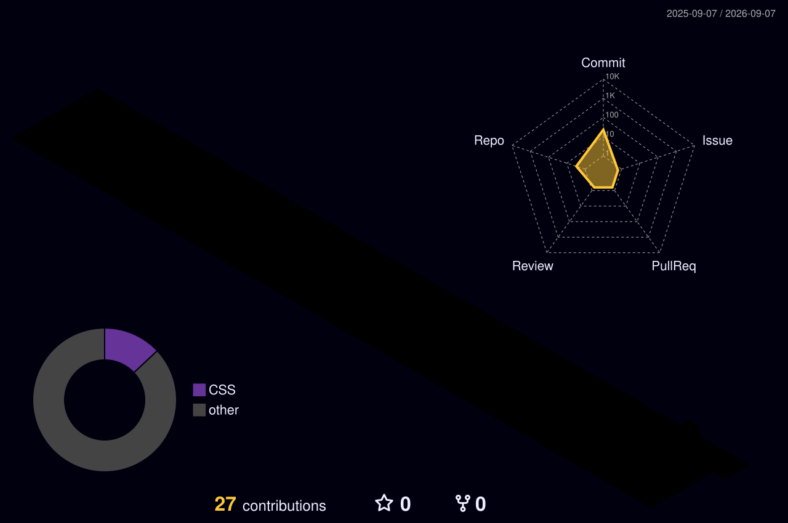

<!-- Profile README for github.com/kevinismiddleton -->

<picture>
  <source media="(prefers-color-scheme: dark)" srcset="https://capsule-render.vercel.app/api?type=waving&amp;color=0:0d1117,20:0c1631,50:112d4e,80:0c1631,100:0d1117&amp;height=230&amp;section=header&amp;text=Phyo%20Pyae%20Kyaw&amp;fontSize=46&amp;fontColor=58a6ff&amp;fontAlignY=30&amp;desc=Electrical%20Engineering%20%E2%80%A2%20Smart%20Grid%20%E2%80%A2%20Cybersecurity&amp;descSize=16&amp;descColor=8b949e&amp;descAlignY=52&amp;animation=fadeIn" />
  <source media="(prefers-color-scheme: light)" srcset="https://capsule-render.vercel.app/api?type=waving&amp;color=0:f6f8fa,20:e0f2fe,50:bae6fd,80:e0f2fe,100:f6f8fa&amp;height=230&amp;section=header&amp;text=Phyo%20Pyae%20Kyaw&amp;fontSize=46&amp;fontColor=0c4a6e&amp;fontAlignY=30&amp;desc=Electrical%20Engineering%20%E2%80%A2%20Smart%20Grid%20%E2%80%A2%20Cybersecurity&amp;descSize=16&amp;descColor=475569&amp;descAlignY=52&amp;animation=fadeIn" />
  
</picture>

<p align="center">
  <a href="https://github.com/kevinismiddleton">
    
  </a>
</p>

<p align="center">
  
  
  
</p>

<p align="center">
  <a href="https://www.linkedin.com/in/kevinscottmiddleton/"></a>&nbsp;
  <a href="https://x.com/mingvin_"></a>&nbsp;
  <a href="https://instagram.com/mingvin_"></a>
</p>

---

## 🧑‍💻 About

<p align="center">
  <a href="https://github.com/kevinismiddleton">
    
  </a>
</p>

<p align="center">
  <em>I enjoy the boundary where physical infrastructure meets software —<br/>measuring real systems, moving their data safely, and turning that data into useful decisions.</em>
</p>

<p align="center">
  ⚡ <strong>Power</strong>&ensp;·&ensp;📡 <strong>Edge</strong>&ensp;·&ensp;🌐 <strong>Networks</strong>&ensp;·&ensp;🔐 <strong>Security</strong>
  <br/>
  <sub>Smarter grids&ensp;·&ensp;IoT &amp; embedded&ensp;·&ensp;Infrastructure &amp; communication&ensp;·&ensp;Energy system protection</sub>
</p>

<details>
<summary>&ensp;<strong>📋 More about me</strong></summary>
<br/>

```text
🎓  3rd-year EE & Smart Grid Technology student at Chiang Mai University
🌏  Based in Chiang Mai, Thailand · originally from Myanmar
🔬  Research interest: SCADA security and grid observability
🧰  Love building things that bridge hardware and software
🎮  When not coding: gaming, exploring coffee shops, late-night debugging
🗣️  Languages: Burmese (native) · English · Thai
```

</details>

> 🔭 &ensp; **Currently:** studying EE and smart-grid technology, exploring network security, and building across the hardware/software boundary.

---

## ⚡ Engineering Map



> That end-to-end path — from electrons to authenticated packets — is the kind of system I want to understand deeply.

---

## 🛠️ Toolkit

<p align="center"><samp>Languages &amp; Analysis</samp></p>
<p align="center">
  
</p>

<p align="center"><samp>Web &amp; APIs</samp></p>
<p align="center">
  
</p>

<p align="center"><samp>Systems &amp; Security</samp></p>
<p align="center">
  
</p>

<p align="center"><samp>Hardware &amp; Cloud</samp></p>
<p align="center">
  
</p>

<details>
<summary>&ensp;<strong>⚙️ How I approach a system</strong></summary>
<br/>

| Step | Action |
| :---: | :--- |
| `01` | Understand the physical process and its failure modes |
| `02` | Measure the right signals, as close to the source as practical |
| `03` | Move data through the smallest reliable interface |
| `04` | Treat security and observability as design inputs — not add-ons |
| `05` | Keep it simple enough to test, explain, and maintain |

</details>

---

## 🎵 Now Playing

<p align="center">
  <a href="https://spotify-github-profile.kittinanx.com/api/view?uid=31z46lacmqlzlgamjscjegnt5f5i&amp;redirect=true">
    
  </a>
</p>

---

## 📊 GitHub Analytics

<!-- Profile Summary Cards — generated by .github/workflows/profile-summary.yml -->
<!-- Run the "GitHub-Profile-Summary-Cards" action manually the first time.     -->
<p align="center">
  <picture>
    <source media="(prefers-color-scheme: dark)" srcset="./profile-summary-card-output/github_dark/0-profile-details.svg" />
    <source media="(prefers-color-scheme: light)" srcset="./profile-summary-card-output/github/0-profile-details.svg" />
    
  </picture>
</p>

<p align="center">
  <picture>
    <source media="(prefers-color-scheme: dark)" srcset="./profile-summary-card-output/github_dark/3-stats.svg" />
    <source media="(prefers-color-scheme: light)" srcset="./profile-summary-card-output/github/3-stats.svg" />
    
  </picture>
  <picture>
    <source media="(prefers-color-scheme: dark)" srcset="./profile-summary-card-output/github_dark/1-repos-per-language.svg" />
    <source media="(prefers-color-scheme: light)" srcset="./profile-summary-card-output/github/1-repos-per-language.svg" />
    
  </picture>
</p>

<p align="center">
  <a href="https://github.com/kevinismiddleton">
    
  </a>
</p>

<p align="center">
  <picture>
    <source media="(prefers-color-scheme: dark)" srcset="https://raw.githubusercontent.com/kevinismiddleton/kevinismiddleton/output/github-snake-dark.svg" />
    <source media="(prefers-color-scheme: light)" srcset="https://raw.githubusercontent.com/kevinismiddleton/kevinismiddleton/output/github-snake.svg" />
    
  </picture>
</p>

<!-- 3D Contribution Graph — generated by .github/workflows/profile-3d.yml   -->
<!-- Run the "GitHub-Profile-3D-Contrib" action manually the first time.      -->
<p align="center">
  <picture>
    <source media="(prefers-color-scheme: dark)" srcset="./profile-3d-contrib/profile-night-rainbow.svg" />
    <source media="(prefers-color-scheme: light)" srcset="./profile-3d-contrib/profile-green-animate.svg" />
    
  </picture>
</p>

---

<p align="center">
  <samp><em>"I debug circuits by day, packets by night."</em></samp>
</p>

<p align="center">
  
</p>

<picture>
  <source media="(prefers-color-scheme: dark)" srcset="https://capsule-render.vercel.app/api?type=waving&amp;color=0:0d1117,20:0c1631,50:112d4e,80:0c1631,100:0d1117&amp;height=100&amp;section=footer" />
  <source media="(prefers-color-scheme: light)" srcset="https://capsule-render.vercel.app/api?type=waving&amp;color=0:f6f8fa,20:e0f2fe,50:bae6fd,80:e0f2fe,100:f6f8fa&amp;height=100&amp;section=footer" />
  
</picture>
